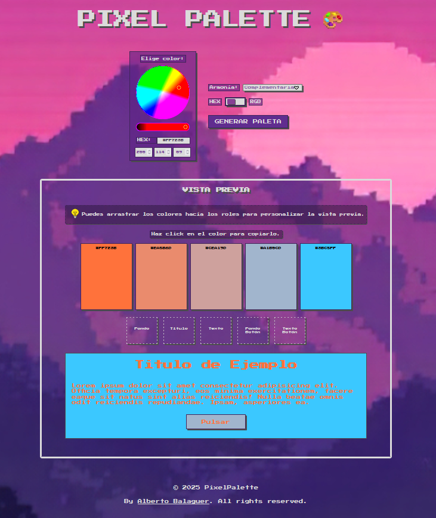

# 🎨 Pixel Palette

Generador de paletas de colores con estética **retro 8-bit**, diseñado para desarrolladores y diseñadores frikis 🎮 que buscan inspiración cromática rápida y divertida.

## 📸 Captura

---

## 🔗 Demo en vivo

👉 [Ver aplicación funcionando](https://albertob86.github.io/pixel-palette/)

---

## ✨ Características

- 🎛️ Selector de armonía cromática: aleatoria, análoga, complementaria, triádica o monocromática.
- 🌈 Selector de color mediante texto HEX o inputs RGB, o bien a través de una rueda visual (`@jaames/iro`).
- 🔄 Sincronización automática entre los valores HEX, RGB y rueda.
- 🔁 Cambio en tiempo real entre formatos **HEX** y **RGB**.
- 🖱️ Funcionalidad *drag & drop* para aplicar los colores a roles visuales: fondo, texto, botones, etc.
- 📋 Copia el color al portapapeles haciendo click.
- 📱 Responsive.
- 👾 Estética pixel retro con interfaz accesible y visualmente atractiva.

---

## 🧰 Tecnologías utilizadas

- HTML5 + CSS3
- JavaScript
- [chroma.js](https://gka.github.io/chroma.js/) – generación de escalas de color
- [iro.js](https://iro.js.org/) – selector de color en rueda

---

## Autor
[🔗 LinkedIn](https://www.linkedin.com/in/albertobalaguer/)

---

## 📄 Licencia

Este proyecto está licenciado bajo la **MIT License**.

---